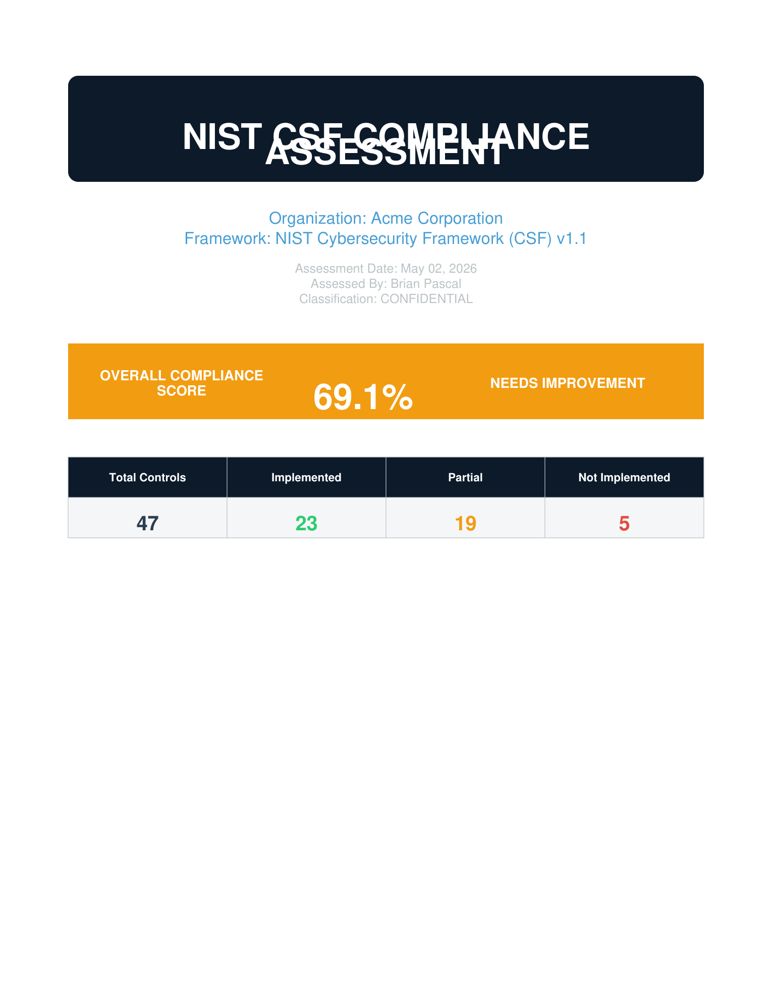
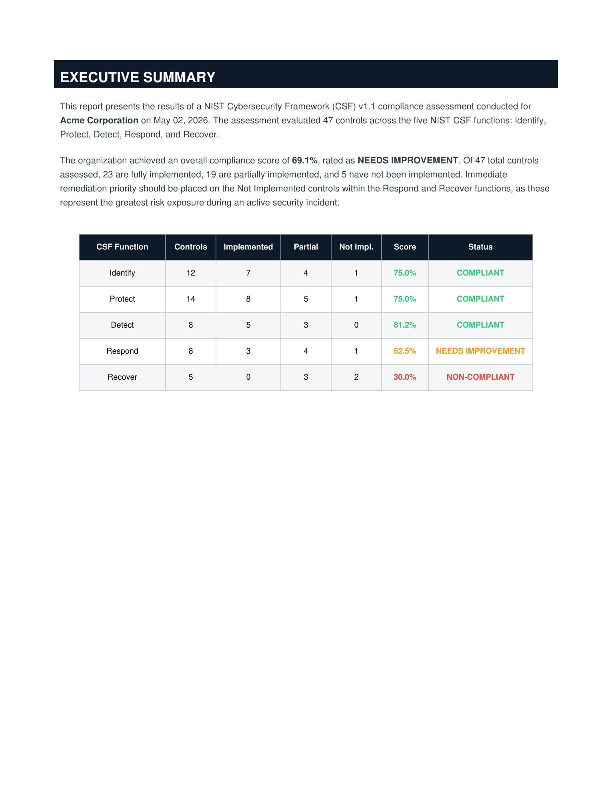
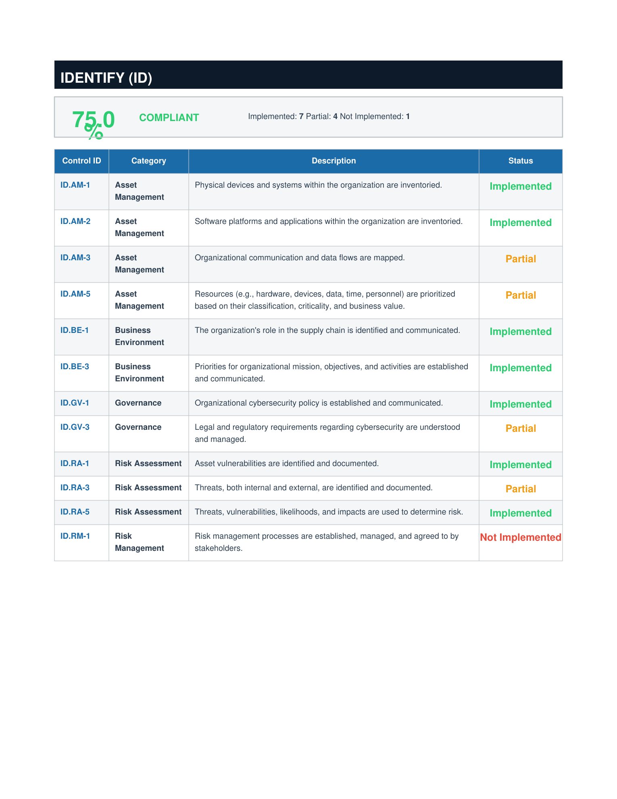
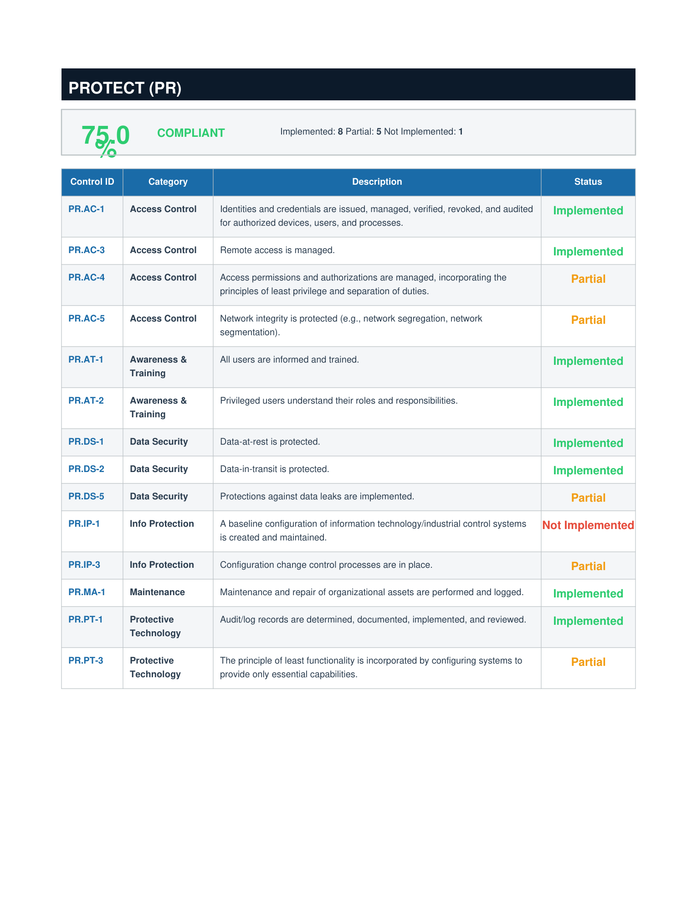
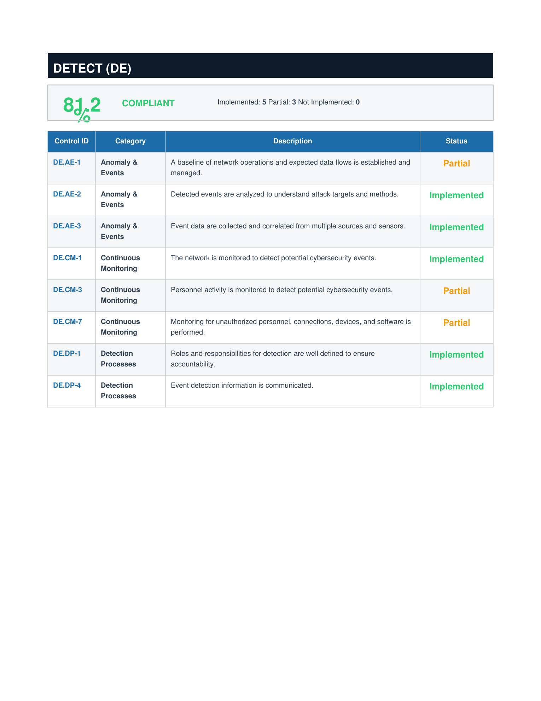
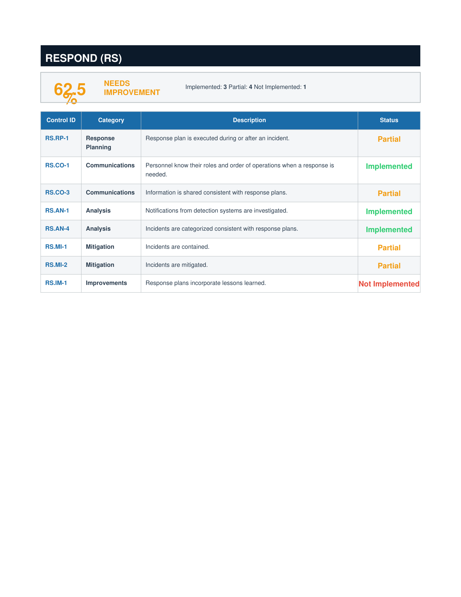
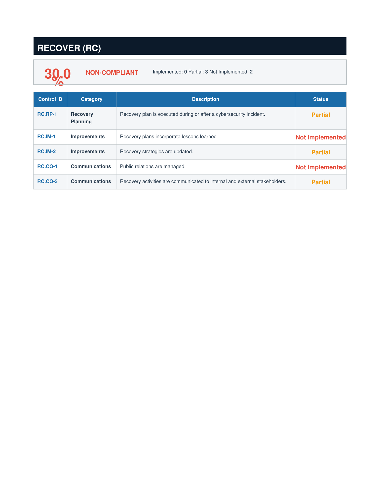
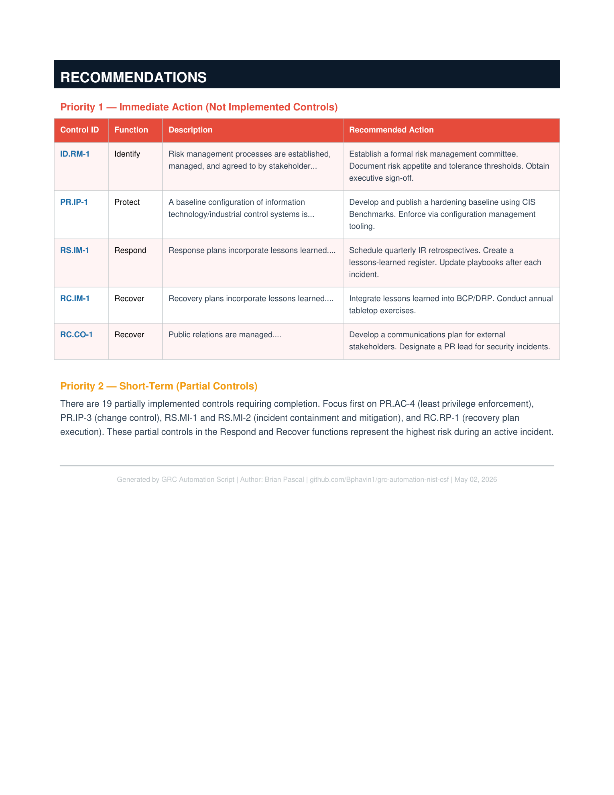

# GRC Automation — NIST CSF Compliance Report Generator

A Python script that automatically generates a professional, multi-page NIST Cybersecurity Framework (CSF) v1.1 compliance assessment report as a polished PDF. Built to demonstrate GRC automation skills for enterprise security and risk roles.

---

## What This Tool Does

Most GRC teams produce compliance reports manually in Word or Excel — a slow, error-prone process. This script automates the entire assessment-to-report pipeline:

- Accepts a list of NIST CSF controls across all 5 functions with implementation status
- Calculates per-function compliance scores and an overall score
- Assigns a status rating (Compliant / Needs Improvement / Non-Compliant) to each function
- Generates a prioritized recommendations section for Not Implemented and Partial controls
- Outputs a fully formatted, CISO-ready PDF report

---

## Report Structure

| Page | Content |
|------|---------|
| 1 | Cover page with org info, assessment metadata, overall compliance score |
| 2 | Executive summary with function-by-function breakdown table |
| 3-7 | Per-function control detail pages (Identify, Protect, Detect, Respond, Recover) |
| 8 | Recommendations — Priority 1 (Not Implemented) and Priority 2 (Partial) |

---

## Screenshots of Actual Output










## Sample Output

The included `NIST_CSF_Compliance_Report.pdf` was generated by running the script against sample data for Acme Corporation.

**Overall Score: 69.1% -- Needs Improvement**

| Function | Score | Status |
|----------|-------|--------|
| Identify | 75.0% | Compliant |
| Protect | 75.0% | Compliant |
| Detect | 81.2% | Compliant |
| Respond | 62.5% | Needs Improvement |
| Recover | 30.0% | Non-Compliant |


---

## How to Run

### Prerequisites

```bash
pip install reportlab
```

### Run the script

```bash
python3 grc_compliance_report.py
```

The script runs immediately with built-in sample data and outputs `NIST_CSF_Compliance_Report.pdf` in the current directory.

### Customize for a real assessment

Edit the `CONTROLS` list in `grc_compliance_report.py` and update the `ORG_INFO` block at the top of the script with your organization name, assessor name, and assessment date. Change each control's `"status"` field to `"Implemented"`, `"Partial"`, or `"Not Implemented"` based on your findings.

---

## Tech Stack

- Python 3
- reportlab — PDF generation

---

## Skills Demonstrated

- GRC automation and process engineering
- NIST Cybersecurity Framework (CSF) v1.1 control mapping
- Compliance scoring logic and risk prioritization
- Python scripting for security tool development
- Professional report generation (audit-ready output)

---

## Author

**Brian Pascal**
GRC and Third-Party Risk Manager | AI Governance | NIST CSF | CompTIA Security+
GitHub: [github.com/Bphavin1](https://github.com/Bphavin1)
LinkedIn: [linkedin.com/in/brianpascalsecurity](https://linkedin.com/in/brianpascalsecurity)
